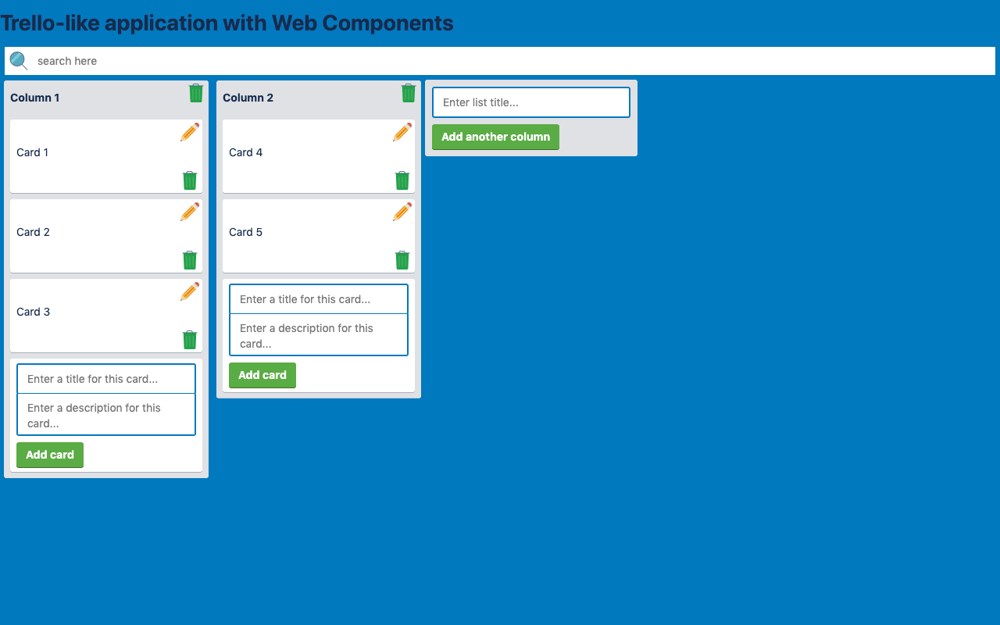
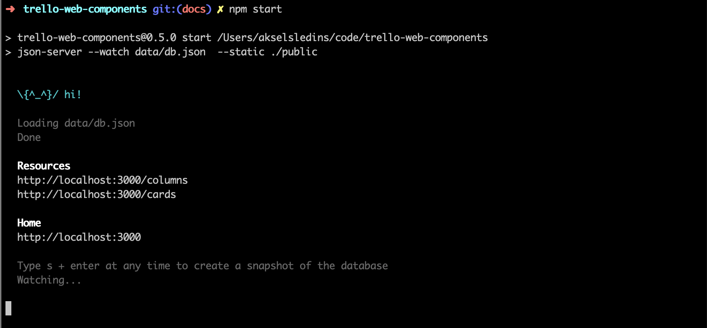
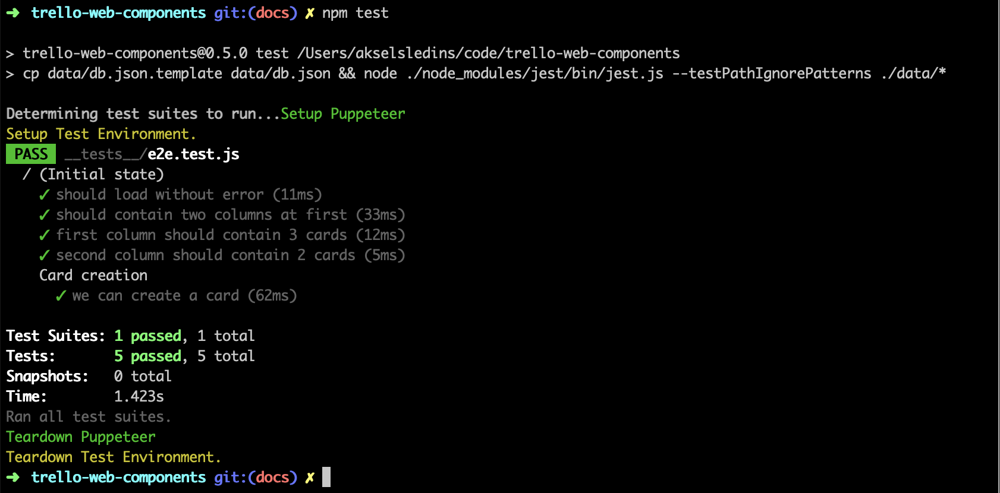

<div align="center">

[](https://github.com/AkselsLedins/trello-web-components/issues)
[](https://github.com/AkselsLedins/trello-web-components/network)
[](https://github.com/AkselsLedins/trello-web-components/network)
[](https://twitter.com/intent/tweet?text=Wow:&url=https%3A%2F%2Fgithub.com%2FAkselsLedins%2Ftrello-web-components)
[](https://github.com/AkselsLedins/trello-web-components)
</div>


<h1>Trello-like - with Web Components</h1>

<br /><br />
<br /><br />
<br /><br />

* ✔ Vanilla JS
* ✔ Lightweight (36ko uncompressed)
* ✔ No dependencies (except for testing)
* ✔ Decent UX
* ✔ Works


<div align="center">
  
</div>

<hr />

### Features

* ✓ display all columns with all cards
* ✓ create a new card
* ✓ modify a card
* ✓ delete a card
* ✓ add a column
* ✓ delete a column
* ✓ search for any keywords presents on one or multiple cards
* ✓ drag and drop a card from one column to another
* ✓ click on a card to see its description

### Missing features

* ❌ #14 modify a column
* ❌ #10 cards and columns should be unique

Any contribution is welcome. Please see [CONTRIBUTING.md](./docs/CONTRIBUTING.md)

<hr />

### How do I launch it?

#### Setup

```
$> npm install
```

> Q: But you said no dependencies?
>
> A: We use json-server to serve our index.html and to create an API.

#### Start the application

```
$> npm start
```

<div align="center">
  
</div>

You can access the application on your browser at `http://localhost:3000`

#### Test the application

```
$> npm test
```

The application should be running on port `3000`. <br />
This will test the application. Beware, it will **override** the database in `data/db.json`.

<div align="center">
  
</div>

##### Testing Strategy

There are only one E2E test. We believe that it will be counter-productive writing unit tests for this app.

At the moment the application is not covered at 100%. Each feature should be tested and CircleCI should be connected to this repository in order to prevent defects in future developments.
