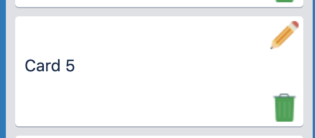
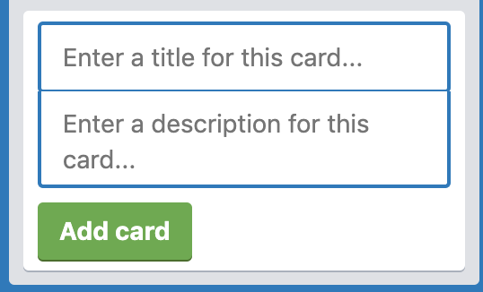
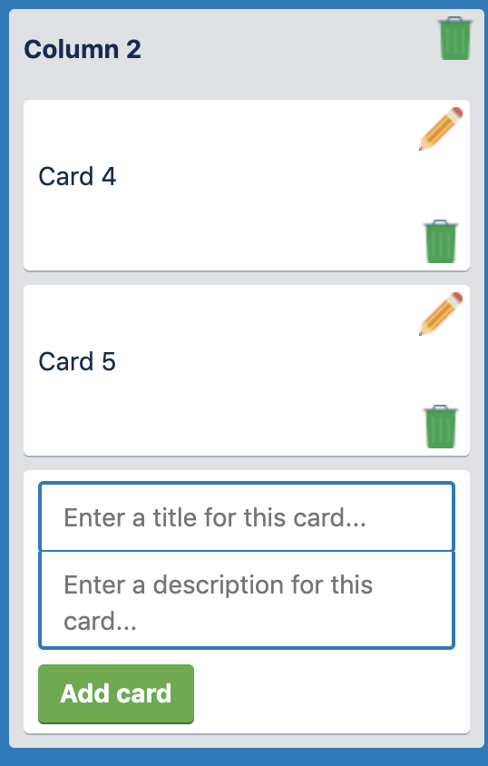
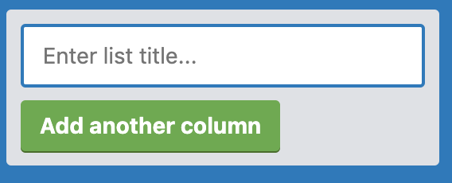
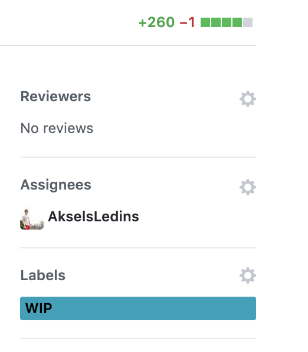
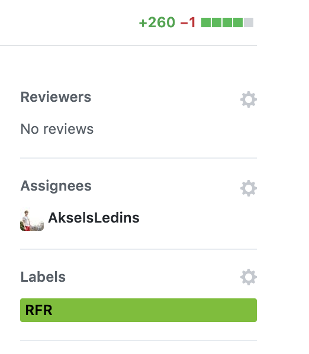

# Contributing

When contributing to this repository, please first discuss the change you wish to make via issue,
email, or any other method with the owners of this repository before making a change.

Please note we have a code of conduct, please follow it in all your interactions with the project.

## Specification

* The code needs to work after we pull it, npm install, npm test and npm start, with no bugs.
* All code should be self-contained (i.e. there should not be any npm dependencies for serving etc. that are globally installed)
* Each Update must be saved to db.json file using the fake API
* The view should be responsive, user-friendly and clear.
* Testing (where applicable) should cover as much of the application as possible. We are using JEST.

## Commiting

Please use Semantic Commit Messages.

```
(type) summary
```

Examples of types:

```
(style)  => design, css, ui, ux
(base)   => infra, dependencies
(docs)   => documentation
(feat)   => feature
(refac)  => refactor
(bug)    => solved an issue
```

## Codebase

There is **5** Web components at the moment.

### _TrelloApp_ `<trello-app>`

It's the root of our application.

### TrelloCard `<trello-card-creator>`

Displays a card from the API.

<div align="center">
  
</div>

### TrelloCardCreator `<trello-card-creator>`

Allows to create cards within the application.

<div align="center">
  
</div>

### TrelloColumn `<trello-card-creator>`

Handles cards and card creator.

<div align="center">
  
</div>


### TrelloColumn `<trello-card-creator>`

Handles cards and card creator.

<div align="center">
  
</div>


### TrelloColumnCreator `<trello-card-creator>`

Allows to create columns within the application.

<div align="center">
  
</div>

## Pull requests

When creating a pull request, the content will be automatically filled with a default PR structure.
Just fill it.

When you are working on it label it as **WIP**.

<div align="center">
  
</div>

When you think your code is ready to merge, then ask for a review (label it as **RFR** and ask for a review.).

<div align="center">
  
</div>
